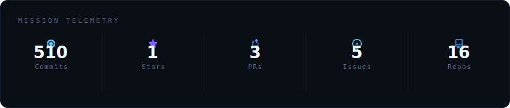

<!-- Galaxy Profile README -->

  

 

  

 

  

 

  

 

<strong>More about me</strong>

 

- Full Stack Developer based in Portugal
- Strong focus on backend architecture and structured systems
- Experience building real-world applications
- Currently completing a Level 5 qualification, with plans to pursue a Bachelor's degree in Software Engineering

 

  
  
  

